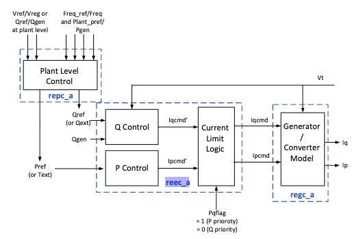

# Stability-Constrained Unit Commitment with ANDES and NCET

## 1. Purpose and scope

This tutorial builds a complete, readable workflow for small-signal-stability-constrained unit commitment (UC):

$$
\text{ANDES data generation}
\rightarrow \text{critical-eigenvalue regression}
\rightarrow \text{surrogate embedding}
\rightarrow \text{stability-constrained UC}
\rightarrow \text{dynamic verification}.
$$

Small-signal stability is obtained from eigenvalue analysis of the full nonlinear dynamic model, meaning that it contains all dynamics on PLL, inverter controllers, and generator governors. The tutorial does not sample an analytical generalized short-circuit ratio (gSCR).

The implementation uses open-source packages:

- [ANDES](https://andes.readthedocs.io/en/latest/) for AC power flow, dynamic initialization and eigenvalue analysis;
- [PyTorch](https://pytorch.org/) for the neural-network regressor;
- [CVXPY](https://www.cvxpy.org/) for the UC model; and
- [NCET](https://github.com/xuwkk/ncet) for converting the trained ReLU network into exact mixed-integer linear constraints.

This is an instructional model rather than a production UC. It uses one time period, a fixed load distribution and no transmission constraints, power losses, ramping, startup or shutdown variables.

## 2. Current project structure

| File | Purpose |
| --- | --- |
| `small_signal_concept_with_andes.ipynb` | Inspect the ANDES workbook and model tables, run AC power flow, and evaluate one small-signal operating point. |
| `stability_constrained_optimization_with_ncet.ipynb` | Generate data, train the regressor, embed it with NCET, solve both UC cases and verify them with ANDES. |
| `system_constants.py` | Store the shared case name, system base, device indices, operating limits, load data and sampling ranges. |
| `small_signal_functions.py` | Build an ANDES operating point, run feasibility checks and eigenvalue analysis, and generate the dataset. |
| `neural_network_functions.py` | Scale regression data, calculate training metrics and save the trained model. |
| `outputs/small_signal_dataset.csv` | Accepted ANDES samples used by the regressor. |
| `outputs/critical_eigenvalue_regressor.pt` | Saved PyTorch weights plus feature order and scaling factors. |

The notebooks contain the explanations and the main experiment. Reusable implementation details remain in the Python modules so that notebook cells stay short.

## 3. IEEE 14-bus SG-GFL system

The project uses the built-in ANDES case `ieee14/ieee14_regcp1.xlsx` on a 100-MVA base.

| Bus | Device | Treatment in the tutorial |
| --- | --- | --- |
| 1 | `GENROU` synchronous generator | Always-online Slack and angle reference. Its active and reactive outputs are solved by AC power flow. |
| 2, 3, 6 | `GENROU` synchronous generators | Commitment and active-power dispatch are varied. |
| 8 | `REPCA1` + `REECA1` + `REGCP1` + `PLL1` GFL resource | Always online; its actual solar injection is varied or curtailed. |
| 2, 3, 4, 5, 6, 9–14 | Constant-PQ loads | Total active demand varies with fixed bus shares; reactive demand preserves each bus's base-case power factor. |

When a synchronous generator at bus 2, 3 or 6 is online, its `PV` model specifies active power and voltage magnitude for power flow; the solver determines its reactive injection and bus angle. When the generator is offline, its `PV` and `GENROU` rows are disabled, and a load at the same physical bus remains connected as a PQ device.

### 3.1 Switchable synchronous generators

The common table in `system_constants.py` links each physical generator across the static and dynamic ANDES models:

```python
SWITCHABLE_SGS = (
    {"bus": 2, "pv": 2, "generator": "GENROU_2", "governor": "TGOV1_2"},
    {"bus": 3, "pv": 3, "generator": "GENROU_3", "governor": "TGOV1_3"},
    {"bus": 6, "pv": 4, "generator": "GENROU_4", "governor": "TGOV1_4"},
)
```

The `pv` numbers are ANDES model indices, not Python row positions, so they do not need to start at zero or one. The power limits, in bus order `(2, 3, 6)`, are

$$
P_g^{\min}=(10,10,30)\ \text{MW},\qquad
P_g^{\max}=(50,50,50)\ \text{MW}.
$$

Bus 6 uses a 30-MW minimum because `TGOV1_4.VMIN = 0.30` pu. When a generator is disconnected, the code also sets its governor `VMIN` to zero so that an offline turbine does not retain a positive mechanical-power minimum.

### 3.2 Fixed weak-grid setting

Every sample uses the same network and controller parameters:

- the GFL `PV.pmax` is set to 1.0 pu, or 100 MW;
- the original `PLL1` gains are retained: $K_p=1.0$ and $K_i=0.2$; and
- `Line_20`, between buses 8 and 7, has its reactance increased from 0.17615 pu to 0.792675 pu, or 4.5 times the original value.

This fixed weak-grid configuration creates a useful mixture of stable and unstable samples.

### 3.3 Dynamic control hierarchy

The ANDES dynamic models are layers of one physical device rather than separate generators.

| Model | Role |
| --- | --- |
| `GENROU` | Round-rotor synchronous-machine dynamics. |
| `TGOV1` | Turbine-governor response and mechanical-power limits. |
| `ESST3A` / `EXST1` | Excitation-system and voltage-control dynamics for synchronous generators. |
| `REPCA1` | Renewable plant-level active/reactive supervisory control. |
| `REECA1` | Converter electrical control, including active/reactive command logic and current limiting. |
| `REGCP1` | Aggregated grid-following converter interface that injects current into the network. |
| `PLL1` | Phase-locked loop used by the converter to track the grid angle. |

The GFL path is

```text
plant reference --> REPCA1 --> REECA1 --> REGCP1 --> bus 8
                                           ^
                                           |
                           bus voltage --> PLL1
```

The project control diagram is available:

.

## 4. Operating-point representation

The neural-network input and the UC-dependent operating point are

$$
x=[u_2,u_3,u_6,P_{g,2},P_{g,3},P_{g,6},P_{s,8},P_L^{\mathrm{total}}].
$$

The first three quantities are binary commitment decisions. The remaining quantities are active powers in MW. Slack power is excluded because it is determined by the balance and then recomputed by the AC power flow.

The base load total is 223.7 MW. Sampling uses

$$
P_L^{\mathrm{total}}=s_LP_L^{\mathrm{base}},
\qquad s_L\sim U(0.8,1.4),
$$

so total demand spans 178.96–313.18 MW. Each bus retains its base share:

$$
P_{l,i}=P_L^{\mathrm{total}}
\frac{P_{l,i}^{\mathrm{base}}}{\sum_jP_{l,j}^{\mathrm{base}}}.
$$

Reactive demand is reconstructed using the individual base-case ratio at each bus:

$$
Q_{l,i}=P_{l,i}\frac{Q_{l,i}^{\mathrm{base}}}{P_{l,i}^{\mathrm{base}}}.
$$

Therefore, every bus preserves its own load share and power factor. Under this fixed spatial pattern and simplified UC without network constraints, total demand is a sufficient load feature. If bus-level load patterns or transmission constraints are later allowed to vary independently, the load vector or a suitable spatial representation must be restored as an NN input.

## 5. ANDES data generation

### 5.1 Sampling

The all-off commitment is excluded, leaving seven commitment combinations. For each commitment:

- one of every four candidates is a broad sample;
- the other three are targeted high-solar boundary samples;
- an offline SG has zero output;
- an online SG in a broad sample is uniform over its full $P^{\min}$–$P^{\max}$ range;
- an online SG in a boundary sample is uniform from $P^{\min}$ to at most $P^{\min}+10$ MW;
- broad solar is uniform over 0–100 MW;
- targeted solar is uniform over 92–96 MW; and
- total load is uniform over 80%–140% of the base total.

The targeted samples increase coverage of the high-solar, low-synchronous-generation region where the stability boundary occurs. They do not guarantee a particular stable/unstable ratio because AC feasibility and the nonlinear eigenvalue response still determine acceptance and labels.

Before loading ANDES, a lossless approximation is used to reject obviously infeasible points:

$$
P_{\mathrm{slack}}^{\mathrm{approx}}
=P_L^{\mathrm{total}}-\sum_gP_g-P_s.
$$

Candidates are resampled until this value lies between 50 and 200 MW. The check is only a pre-screen because network losses are not yet known.

### 5.2 Apply one operating point

For every sample, `build_system()` loads a fresh ANDES system so that status and state changes cannot leak between samples. It then applies

```text
PV/GENROU status <- u_g
PV.p0             <- P_g / 100 MVA
GFL PV.p0         <- P_s / 100 MVA
PQ.p0             <- bus active loads / 100 MVA
PQ.q0             <- PQ.p0 times each bus's base Q/P ratio
```

The minimal current API is:

```python
import small_signal_functions as ss

point = ss.OperatingPoint(
    sg_online=(1, 1, 1),
    sg_power_mw=(10.0, 10.0, 30.0),
    gfl_power_mw=90.0,
    load_power_mw=tuple(const.BASE_LOAD_POWER_MW),
)

with ss.silence_andes_output():
    system = ss.build_system(point)
    slack_power_mw = ss.solve_power_flow(system)
    result = ss.calculate_small_signal(system, slack_power_mw)
```

### 5.3 Feasibility and initialization checks

The current implementation accepts a sample only if:

1. the ANDES AC power flow converges;
2. the realized Slack output, including AC losses, is within its workbook limits;
3. every bus voltage is within its workbook limits;
4. dynamic initialization succeeds; and
5. ANDES can evaluate the initialized DAE and produce physical eigenvalues.

The tutorial currently does **not** enforce generator reactive-power limits or branch-flow limits. Rejected candidates are omitted from the CSV; their categorized reasons are returned separately in `failure_counts`.

### 5.4 Eigenvalue analysis and target

After power flow, ANDES initializes the differential-algebraic model

$$
\dot x=f(x,y),\qquad 0=g(x,y).
$$

Linearization and elimination of algebraic variables give the reduced state matrix

$$
A=f_x-f_yg_y^{-1}g_x,
\qquad \Delta\dot x=A\Delta x.
$$

ANDES calculates the eigenvalues of $A$. Structural zero modes, such as the reference-angle mode, are removed using `system.EIG.config.tol`. The critical mode is the remaining eigenvalue with the largest real part:

$$
\lambda_{\mathrm{crit}}
=\underset{|\lambda_i|>\mathrm{tol}}{\arg\max}\;
\operatorname{Re}(\lambda_i),
\qquad
\alpha=\operatorname{Re}(\lambda_{\mathrm{crit}}).
$$

The continuous regression target is `critical_real` $=\alpha$. The diagnostic class is

$$
\mathrm{label}=
\begin{cases}
0, & \alpha\le-10^{-4} \quad \text{(stable)},\\
1, & \alpha>-10^{-4} \quad \text{(unstable or inside the margin)}.
\end{cases}
$$

The CSV columns are

```text
u_2, u_3, u_6,
P_g2_mw, P_g3_mw, P_g6_mw,
P_s8_mw, P_load_total_mw,
label, critical_real, critical_imag, slack_power_mw
```

`label`, `critical_imag` and `slack_power_mw` are diagnostics and are not regressor inputs.

### 5.5 Generate the current tutorial dataset

```python
dataset, failure_counts = ss.generate_dataset(
    samples_per_commitment=100,
    random_seed=7,
    output_path=const.OUTPUT_DIR / "small_signal_dataset.csv",
    verbose=False,
    show_progress=True,
    suppress_andes_output=True,
)
```

This attempts 700 candidates in total. The accepted count depends on the AC and dynamic checks. The notebook reports acceptance rate, rejection categories, class balance and commitment coverage after generation.

## 6. Critical-eigenvalue regression

The regressor learns

$$
\hat\alpha=\mathcal N_\theta(x),
$$

rather than directly classifying the stability label. Regression preserves distance from the stability boundary and allows the UC to impose a tunable negative margin.

For this introductory experiment, every accepted sample is used for training; there is no validation or test split. The three binary commitments remain unchanged, while every continuous MW input is divided by `SYSTEM_BASE_MVA = 100`. This is only numerical scaling and is not a physical upper bound. For example, normalized total load spans approximately 1.79–3.13.

The explicit PyTorch architecture is

```python
regressor = torch.nn.Sequential(
    torch.nn.Linear(8, 48),
    torch.nn.ReLU(),
    torch.nn.Linear(48, 24),
    torch.nn.ReLU(),
    torch.nn.Linear(24, 1),
)
```

The final layer is linear because `critical_real` can be positive or negative. Training uses full-batch mean-squared error, Adam with learning rate $3\times10^{-3}$, weight decay $10^{-4}$ and 1500 epochs.

The notebook reports in-sample MAE, RMSE, $R^2$ and false-stable count. These metrics measure fit to the training samples only and do not establish generalization or a safety guarantee.

## 7. One-period UC formulation

For a fixed total demand $P_L$ and available solar $P_s^{\mathrm{avail}}$, the decisions are:

- $u_g\in\{0,1\}^3$: commitments of SGs at buses 2, 3 and 6;
- $P_g$: their active-power outputs;
- $P_0$: output of the always-online Slack generator; and
- $P_s$: actual solar injection after curtailment.

The baseline UC is

$$
\begin{aligned}
\min\quad
&c_0P_0+c_g^TP_g+c_u^Tu_g
+c_{\mathrm{curt}}(P_s^{\mathrm{avail}}-P_s)\\
\text{s.t.}\quad
&P_g^{\min}u_g\le P_g\le P_g^{\max}u_g,\\
&P_0^{\min}\le P_0\le P_0^{\max},\\
&0\le P_s\le P_s^{\mathrm{avail}},\\
&P_0+\mathbf 1^TP_g+P_s=P_L,\\
&\mathbf 1^Tu_g\ge1.
\end{aligned}
$$

The last constraint excludes the all-off commitment because it is absent from the training data. The current example uses base total demand 223.7 MW and 95 MW of available solar. Its illustrative costs are:

| Cost | Value |
| --- | ---: |
| Slack energy | 30 per MWh |
| SG energy at buses 2, 3, 6 | 60, 34, 31 per MWh |
| SG commitment at buses 2, 3, 6 | 50, 30, 10 |
| Solar curtailment | 100 per MWh |

These values are tutorial choices, not cost data from the ANDES workbook. They make the bus-6 SG the cheapest switchable unit, so the baseline model tends to choose a low-cost operating point that may be small-signal unstable.

The balance is lossless, whereas ANDES later recomputes Slack output with AC losses. The final ANDES evaluation is therefore essential.

## 8. Embed the regressor with NCET

NCET converts every PyTorch `Linear` and `ReLU` operation into an exact mixed-integer linear representation of the trained network.

### 8.1 Input bounds

Bounds must use the same feature order and normalization as training:

```text
[u_2, u_3, u_6, P_g2, P_g3, P_g6, P_s8, P_load_total]
```

For the example UC, the normalized bounds are:

- commitment: $[0,1]$;
- each SG power: $[0,P_g^{\max}/100]=[0,0.5]$ pu;
- solar: $[0,95/100]=[0,0.95]$ pu; and
- total load: fixed at $223.7/100=2.237$ pu.

The load bound being greater than one is correct: a 100-MVA base is a divisor, not a 100-MW upper limit.

### 8.2 Encode and connect the network

```python
from ncet import Bounds, form_milp

regressor.eval()
nn_encoding = form_milp(
    regressor,
    Bounds(lower=nn_lower_bound, upper=nn_upper_bound),
    relu_binary_mode="reduced",
)

# This Sequential model has exactly one NCET input tensor.
nn_input_variables = list(nn_encoding.inputs.values())
if len(nn_input_variables) != 1:
    raise ValueError("This tutorial expects one neural-network input.")
nn_input = nn_input_variables[0]
predicted_critical_real = nn_encoding.outputs[0][0]
```

Converting `encoding.inputs.values()` to a list makes the dictionary contents explicit, verifies that this tutorial has exactly one input tensor, and then selects that tensor. The input is linked to the normalized UC feature expression in the exact training-column order.

The `reduced` mode introduces binary variables only for ReLUs whose activation sign cannot be proven from the supplied bounds.

### 8.3 Add the stability constraint

The stability-constrained UC adds

$$
\hat\alpha\le-\epsilon_{\mathrm{UC}}
$$

with the current tutorial choice $\epsilon_{\mathrm{UC}}=0.01\ \mathrm{s}^{-1}$:

```python
stability_constraints = (
    uc_constraints
    + list(nn_encoding.constraints)
    + [
        nn_input == uc_feature_expression,
        predicted_critical_real <= -0.01,
    ]
)
```

NCET exactly represents the trained network, but the network itself remains an approximation of ANDES. The 0.01 margin is an example-specific buffer selected from tutorial spot checks; it is not a calibrated probabilistic guarantee.

## 9. Evaluation

Solve and compare two models under the same demand, available solar, costs and operating limits:

1. **Baseline UC:** the one-period UC without the neural-network constraints.
2. **Stability-constrained UC:** the same UC plus the NCET encoding and $\hat\alpha\le-0.01$.

For each optimized point, the following steps are taken:

1. reconstruct the bus-level loads from the fixed shares;
2. apply the commitment, dispatch and actual solar injection to a fresh ANDES system;
3. solve AC power flow and recompute the realized Slack output;
4. initialize the dynamic models;
5. calculate the critical eigenvalue; and
6. compare cost, commitment, dispatch, curtailment, NN prediction and ANDES result.

The ANDES eigenvalue calculation, not the NN output, is the final physical verification. A predicted value satisfying $-0.01$ may still differ numerically from the ANDES value because of regression error.

## 10. Google Colab

Both notebooks contain a setup cell explicitly marked **GOOGLE COLAB ONLY**. In Colab, it clones `https://github.com/xuwkk/Neural-SmallSignal-UC-Tutorial`, changes into the project directory and installs `requirements-colab.txt`. In a local Jupyter environment, the cell performs no action. The Colab badges in `README.md` and at the top of each notebook will work after the project is published at that repository URL.

Colab storage is temporary. Download the generated dataset and trained model from `outputs/` before ending the runtime if they need to be retained.

## 11. Current limitations and next extensions

The current tutorial deliberately fixes several quantities. The most important extensions are:

- create validation and test sets, or use cross-validation, before interpreting surrogate accuracy;
- calibrate the UC stability margin using out-of-sample false-stable risk;
- use adaptive sampling near the learned stability boundary;
- vary bus-level load patterns if network location becomes relevant;
- add DC or AC transmission constraints and valid branch ratings;
- add reactive-power feasibility checks using reviewed generator limits;
- extend UC to multiple periods with ramping, minimum up/down time, startup and shutdown costs; and
- vary controller parameters only if they are intended to become explicit planning or control variables, then include them as NN features.

## References

[1] F. Fang, M. Rahmatian, and K. Chilukuri, “Active and Reactive Power Priority Imposed by Current Limit Logic in Inverter-Based Generators,” in *Proc. 2020 CIGRE Canada Conference*, Toronto, ON, Canada, Oct. 19–22, 2020, paper CIGRE-295.

[2] Electric Power Research Institute (EPRI), *Model User Guide for Generic Renewable Energy System Models*, Technical Update, Palo Alto, CA, USA, EPRI Rep. 3002006525, Jun. 2015.

[3] W. Xu, Z. Chu, and F. Teng, “Learning-Augmented Power System Operations: A Unified Optimization View,” *IEEE Transactions on Power Systems*, pp. 1–21, 2026, doi: 10.1109/TPWRS.2026.3726363.
